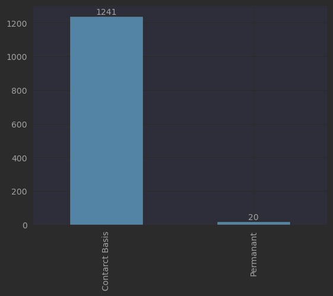
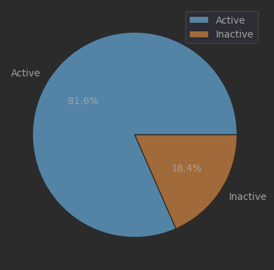
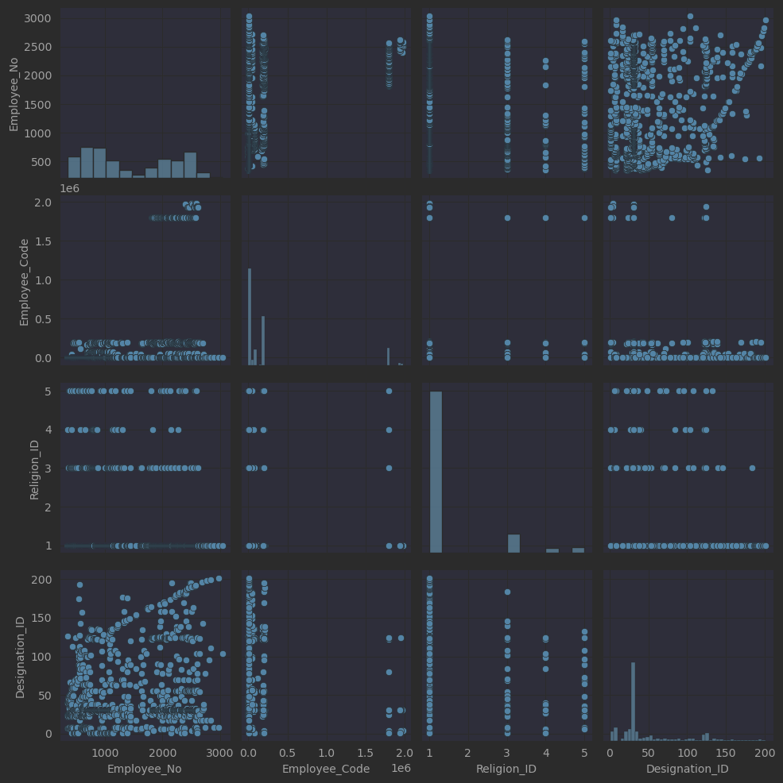

## Descriptive Analysis

| Univariate                         |     Result |
|------------------------------------|-----------:|
| Number of employees in the dataset |       1261 |
| Contract basis employees           |       1241 |
| Permanent employees                |         20 |
| % of active employees              |      81.6% |
| % of resigned employees            |      18.4% |
| Earliest Join_Date                 | 1988-01-27 |
| Latest Join_Date                   | 2022-12-20 |

### Employment Type

### Employee Status

### Pair Plots

### Employment Duration

#### Contract Basis Employees

|       | Employment\_Duration        |
|:------|:----------------------------|
| count | 751                         |
| mean  | 408 days 12:14:22.849533956 |
| std   | 468 days 17:30:17.438927584 |
| min   | 0 days 00:00:00             |
| 25%   | 108 days 12:00:00           |
| 50%   | 261 days 00:00:00           |
| 75%   | 556 days 00:00:00           |
| max   | 3924 days 00:00:00          |
