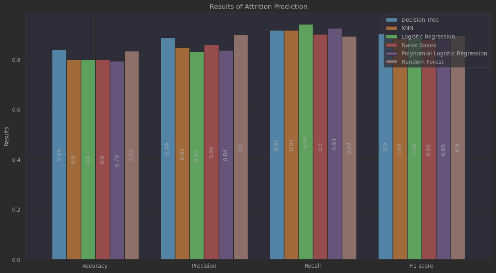

## Team Members -Group G (7)

1. Amali Perera
2. Emindu Perera
3. Priyanka Perera
4. Thushara Sampath

GitHub - https://github.com/pcperera/attrition/

## Directory Structure

| Directory | Content                                            |
|-----------|----------------------------------------------------|
| .         | Jupyter notebook files are ordered by index        |
| data      | data directory contains all data used for analysis |

## Descriptive Analysis

### Entire Dataset 

| Univariate                         |     Result |
|------------------------------------|-----------:|
| Number of employees in the dataset |       1261 |
| Contract basis employees           |       1241 |
| Permanent employees                |         20 |
| % of active employees              |      81.6% |
| % of resigned employees            |      18.4% |
| Earliest Join_Date                 | 1988-01-27 |
| Latest Join_Date                   | 2022-12-20 |

### February 2020 to December 2022 (focused period)

### Model Evaluation

